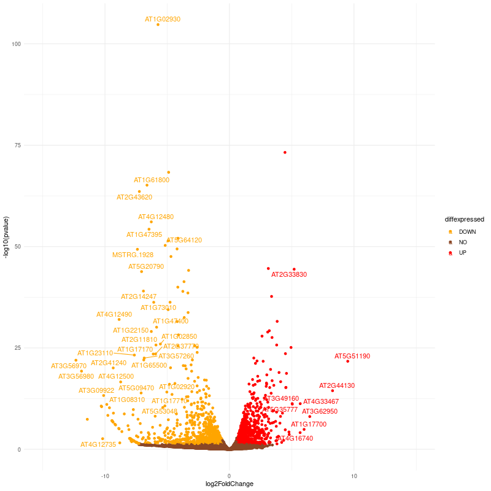
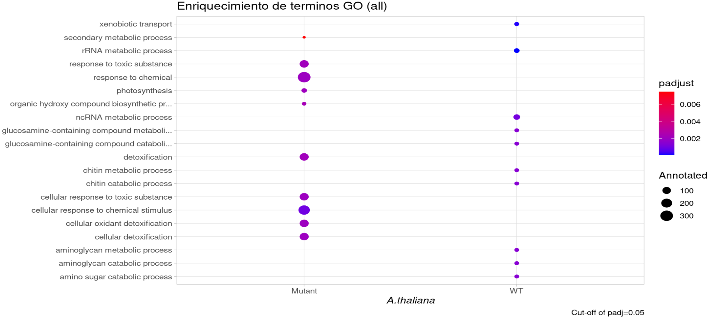
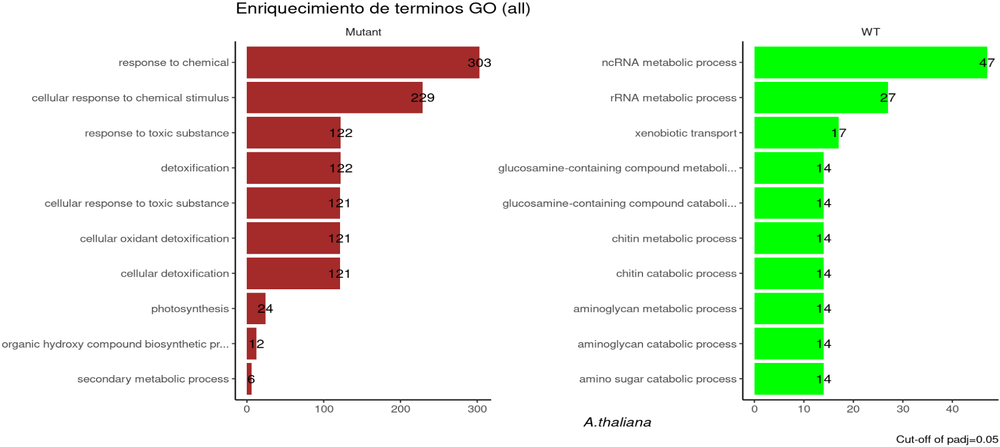

Objetivo: Análisis de datos de RNA-Seq (pipeline completa).

# Abstract
Usando los datos del proyecto PRJNA821620 hicimos un análisis de expresión diferencial entre tres resultados de RNA-Seq de tres plantas wild type (WT) de Arabidopsis thaliana y tres de mutantes llamadas phod1 (phosphate deficiency 1).  Estas mutantes mostraron una expresión de un gen (PHT1;4) relacionado con la deficiencia de fósforo en un medio rico en fosfato, lo que sugiere una alteración en un componente regulador. Nuestro objetivo es identificar las diferencias de expresión de genes que existen entre ambos grupos e identificar la ontología de estos para tratar de observar los mecanismos a través de los cuales esta mutante es capaz de expresar un gen que en principio no debería hacerlo. Para ello seguimos el pipeline “RNA seq” (ref), donde usamos MultiQC para observar la calidad de nuestros datos crudos y sin adaptadores, Kallisto para ensamblar esto con un transcriptoma de referencia, llevar a cabo el análisis de expresión diferencial con DESeq2 y finalmente hacer un análisis funcional go. Nuestros resultados indican que la mutante phod1 tiene una expresión mayor en comparación a WT en genes relacionados con las respuestas celulares a estímulos químicos.

# Descripción de los datos:

  + Bioproject
  
      PRJNA821620

  + Especie
  
      Arabidopsis, Arabidopsis thaliana (AT), the thale cress or mouse-ear cress.
  
  + Tipo de bibliotecas
      
      Paired-end.

  + Método de selección (ej: poly A)

      cDNA       

  + Número de transcriptomas

      6 transcriptomas      
    
  + Número de réplicas biológicas

      - 3 replicas biologicas mutadas
      - 3 replicas biologicas control

  + Secuenciador
      
      Illumina HiSeq 2500
      
  + Distribución de las muestras (control y tratamiento)
    
      - phod1 Mutant: phod1-3 (SRR18552040); phod1-2 (SRR18552041); phod1-1 (SRR18552042) 
      - Wild type: WT-3 (SRR18552043); WT-2 (SRR18552044); WT-1 (SRR18552045)

  + Profundidad de secuenciación de cada transcriptoma
      - SRR18552040: 22.5 M seqs
      - SRR18552041: 22.5 M seqs
      - SRR18552042: 22.1 M seqs
      - SRR18552043: 22.1 M seqs
      - SRR18552044: 34.4 M seqs
      - SRR18552045: 22.1 M seqs
      

# Descarga y analisis de calidad de datos

Una vez descargados los datos, antes de comenzar a hacer cualquier cosa debemos verificar la calidad de estos para evitar errores en el futuro

### Descargar archivos SRA

Primero se descargan los archivos SRA de NCBI, en este caso se mando el job SRA_At_run.sge con los siguienes codigos:

```{bash eval = FALSE}
module load sra/3.0.0
		# El kit de herramientas SRA de NCBI es una colección de herramientas y 
		  #bibliotecas para usar datos de archivos de 
		# lectura de secuencia (SRA) de INSDC. SRA almacena datos de secuenciación 
		  #sin procesar e información de alineación para mejorar la reproducibilidad.

prefetch --option-file ./Athaliana_fastq.txt -O ./data

		# prefetch descarga corridas desde NCBI, con todo lo necesario para 
		  #convertir este archivo en un formato comun. 
		# --option-file es para que prefetch descargue una lista de archivos SRA 
		  #que estan escritos en un archivo .txt.
		# ./Athaliana_fastq.txt es la dirección y el nombre del archivo en este 
		  #caso .txt.
		# -O indica que se quiere obtener un output y lo siguiente (./data) es la 
		  #irección en este caso de donde se quiere guardar el output. 

```

### Cambio de SRA a Fastq

Para poder manipular los datos se necesita un fastq

```{bash eval = FALSE}

fastq-dump --gzip --skip-technical --dumpbase --split-3 --clip --outdir ./data/ ./data/SRR*/*.sra

		#fastq-dump es parte del kit de herramientas SRA y se puede usar para 
		  #convertir las ejecuciones precargadas del formato SRA comprimido al 
		  #formato fastq.
		#--gzip : Descomprimir archivos comprimidos con .gz
		#--skip-technical : Optener solo lecturas de cada replica biologica. No tecnicas.
		#--dumpbase : Formato de las secuencias basada en espacios.
		#--split-3 : Separar archivos dependiendo del SRA en single-end con 
		  #*.fastq, si es paired-end con *_1.fastq y *_2.fastq
		#--clip : Remover adaptadores de las lecturas
		#--outdir : salida
		#./data/ es en donde se encuentran los archivos que se van a usar.
		#./data/SRR*/*.sra es donde va a guardar los archivos de output. 

```


### Calidad de los datos

  Una vez se dispone de los datos se analiza su calidad. Para ello se usa fastqc con el siguiente codigo:

```{bash eval = FALSE}
module load fastqc/0.11.3
fastqc ./data/*.fastq.gz -o ./FastQC_rawData
  # Recibe como parametros todas las secuencias a analizar y con -o se 
    #especifica la ruta donde se quieren guardar los resultados.

```
		
Para el reporte en MultiQC:

```{bash eval = FALSE}
module load multiqc/1.5
multiqc ./FastQC_rawData -o ./FastQC_rawData
	# Con esta herramienta se pueden analizar muchas muestras en un solo informe.
	# La informacion de calidad se encuentra en ./FastQC_rawData y con -o se 
    #selecciona la carpeta donde se almacena el multiQC

```


### Eliminación de adaptadores
	
Se eliminaron adapadores con el archivo FastQCTrimmed_dow.sge:

```{bash eval = FALSE}
  cd data
	for i in *_1.fastq.gz;
	do echo
	trimmomatic PE -threads 8 -phred33 $i "${i%_1.fastq.gz}_2.fastq.gz" \
	../data_trimmed/"${i%_1.fastq.gz}_1_trimmed.fastq.gz" ../data_trimmed/"${i%_1.fastq.gz}_1_unpaired.fastq.gz" \
	../data_trimmed/"${i%_1.fastq.gz}_2_trimmed.fastq.gz" ../data_trimmed/"${i%_1.fastq.gz}_2_unpaired.fastq.gz" \
	ILLUMINACLIP:../TruSeq3-PE.fa:2:30:10 LEADING:3 TRAILING:3 SLIDINGWINDOW:5:20 MINLEN:60
	done
	# El for hace la función de que para cada archivo con terminación 
	  #"_1.fastq.gz" sea procesado con el posterior código de trimmomatic.
	# PE: indica que se está realizando un análisis de lecturas pareadas (paired-end).
	# -threads 8: número de nucleos de procesamiento que se utilizarán. 
	# -phred33: especifica que las lecturas de entrada tienen codificación Phred33. 
	# La cual es es un formato de archivo utilizado para almacenar datos de 
	  #secuenciación de ADN en forma de
	#	puntuaciones de calidad. 
	# $i: variable utilizada para especificar el nombre del archivo de entrada de 
	  #lectura 1.
	# ${i%_1.fastq.gz}_2.fastq.gz: esta expresión se utiliza para generar el 
	  #nombre del archivo de entrada de lectura 2 a partir del nombre del archivo 
	  #de entrada de lectura 1. 
	#	La expresión ${i%_1.fastq.gz} elimina la cadena "_1.fastq.gz" del final 
	  #del nombre del archivo de entrada	de lectura 1  y luego se agrega el 
	  #sufijo "_2.fastq.gz.
	# \: indica que el comando continuará en la siguiente línea.
	# ../data_trimmed/: indica donde se guardara el output.
	# ILLUMINACLIP: corte los adaptadores y otras secuencias específicas de 
	  #Illumina de la lectura. TruSeq3-PE.fa:2:30:10	es el archivo donde se
	  #encuentran las secuencias de estos
	# SLIDINGWINDOW: filtra bases de baja calidad de las secuencias de lectura. 
    #Aplicando un umbral de calidad a las lecturas en la ventana actual y 
	  #descartando las bases que no cumplen con el umbral. Luego, la ventana se 
	  #mueve un número fijo de posiciones y el proceso se repite	hasta que se 
	  #procesan todas las bases de la secuencia. Ayudando a eliminar errores de 
	  #secuenciación y mejorando la precisión de los datos.
	# LEADING: corta las bases del inicio de una lectura, si está por debajo 
	    #de un umbral de calidad.		
	# TRAILING: corta las bases del final de una lectura, si está por debajo 
	  #de un umbral de calidad.
	# MINLEN: descarta la lectura si está por debajo de una longitud específica.
```

Las secuencias limpias de adaptadores se encuentran en la carpeta data_trimmed

### Analisis de calidad de las lecturas sin adaptadores
	
```{bash eval = FALSE}
	cd ../
	fastqc ./data_trimmed/*.fastq.gz -o ./FastQC_trimmed
	multiqc ./FastQC_trimmed -o ./FastQC_trimmed
		Descritos anteriormente.
```
	
Los archivos de calidad se encuentran en la carpeta FastQC_trimmed

# Pseudoalineamiento
Necesitamos alinear los datos de RNA-seq para saber los genes que se han transcrito en los distintos tipos de células

### Ensamblaje con el transcriptoma de referencia (Kallisto) 

Kallisto es una herramienta de mapeo rápido de lecturas de secuencias cortas de ARN a transcriptomas de referencia y permite la estimación de la abundancia de transcritos en una muestra de ARN.
El transcriptoma de referencia usado fue hecho por la doctora Evelia (EveliaCoss github) usando las siguientes herramientas:

	STAR --> Stringtie --> At_stringm_seq_v2.fasta

Este transcriptoma se genero a partir de 254 transcriptomas.
La ruta a este transcriptoma se encuentra en: /mnt/Timina/bioinfoII/rnaseq/BioProject_2023/examples_class/At_BlueDark_example/At_stringm_seq_v2.fasta 

  Se creo un link hacia este para acceder facilmente
  
Para poder hacer la alineacion y cuantificacion de los datos de ARN se necesita un index. El índice de Kallisto es una base de datos que contiene la información de los transcritos de una especie o un conjunto de especies en particular.


### Generar index de kallisto
	
```{bash eval = FALSE}
	module load kallisto/0.45.0 
	kallisto index -i ./kallisto_quant/At_ref.kidx At_stringm_seq_v2.fasta
		# -i: nombre del archivo de salida
		# Input = At_stringm_seq_v2.fasta, transcriptoma de referencia
```

El index se encuetra en la carpeta "kallisto_quant"


### Pseudoalineamiento con kallisto

```{bash eval = FALSE}
for file in ./data_trimmed/*_1_trimmed.fastq.gz                                                         # Read1
do
  clean=$(echo $file | sed 's/^.\{15\}//g;s/_trimmed//;s/_1\.fastq\.gz//;s/_1\.fq\.gz//')   # Nombre de la carpeta de salida, mismo nombre de SRA
  file_2=$(echo ${clean}_2_trimmed.fastq.gz | sed 's/FP/RP/')                                            # Read2
  kallisto quant --index ./kallisto_quant/At_ref.kidx --output-dir ./kallisto_quant/${clean} --threads 12 ${file} ./data_trimmed/${file_2}
	done

  # Con el ciclo for se alinea cada documento con terminación 
	  #"_1_trimmed.fastq.gz" del directorio "data_trimmed".
	# En la variable "clear" se almacena el nombre del SRA que se esta procesando, 
	  #este nombre se asigna elminando partes del nombre del archivo de entrada		
  # Como se tiene una secuenciacion pair-end, existen dos archivos para cada 
	   #muestra, su nombre correspode a la variable clean mas su extensión
	# Se está utilizando el comando kallisto quant para realizar la 
	  #cuantificación de expresión génica.
	# --index: especifica el índice de referencia que se utilizará para realizar 
	  #la alineación y cuantificación.
	# --output-dir: directorio de salida donde se guardarán los resultados de 
	  #la cuantificación. 
	# ${file}: Este argumento especifica el archivo de lectura "Forward Pair" 
	  #que se utilizará para la cuantificación. 
	#  El nombre del archivo se almacena en la variable ${file}.
	# ./data_trimmed/${file_2}: Este argumento especifica el archivo de lectura 
	  #"Reverse Pair" que se utilizará para la cuantificación. 
	#	El nombre del archivo se almacena en la variable ${file_2} y se encuentra 
	  #en el directorio ./data_trimmed/.

```


### Descarga de alineamientos para analisis de expresion diferencial en r

```{bash eval = FALSE}
rsync -rptuvl oleyva@dna.lavis.unam.mx:/mnt/Timina/bioinfoII/rnaseq/
  BioProject_2023/rawData/Athaliana_Pho/kallisto_quant/SRR* .
```

Los archivos de abundancia que se generan a partir de Kallisto contienen información sobre la abundancia de las diferentes isoformas de genes o transcritos en una muestra de RNA-seq. Estos archivos suelen estar en formato de tabla y contienen información como el identificador del gen o transcritos, su longitud, y la cantidad estimada de lecturas que provienen de cada uno de ellos en la muestra. Estos archivos de abundancia son importantes para el análisis de expresión génica, ya que proporcionan una medida de la cantidad relativa de expresión de cada gen o transcritos en diferentes muestras.


# Expresión diferencial

### Librerias requeridas
```{r, warning=FALSE, cache=FALSE, message=FALSE}
# En vez de tidyverse:
library("ggplot2")
library("dplyr")
library("tidyr")
library("readr")
library("purrr")
library("tibble")
library("stringr")
# otros:
library(tximport)
library(DESeq2)
library(ggrepel) # libreria que evita el overlap de texto en labels
```


### Importacion de datos de kallisto en R

```{r, warning=FALSE, cache=FALSE, message=FALSE}
# A. thaliana
# generar tabla de metadatos
At_metadata.tsv <- data.frame("SRA" =c("SRR18552043","SRR18552044", "SRR18552045",
                                       "SRR18552040", "SRR18552041", "SRR18552042"),
          "sample" = c("WT-3","WT-2","WT-1", "phod1-3 ", "phod1-2 ", "phod1-1") , 
          "dex" = c(rep("WT",3), rep("Mutant",3)), 
          "species" = "Arabidopsis_thaliana")

# Anotacion articulo
# Cargar los archivos por nombre del archivo (ubicacion empleando la anotacion de 
  #los 224 transcriptomas) 
At_samples <- At_metadata.tsv 
  # Se crea copia de "At_metadata.tsv".
At_files   <- file.path("/home/onna/Documentos/clases4s/bioinfo/expredife/kallisto",
  At_samples$SRA,"abundance.tsv") 
  # Ubicación del directorio, obtención de nombre de los archivos y se guardan las 
    #+rutas a los 6 archivos "abundance.tsv".
names(At_files) <- At_samples$SRA 
  # A cada ruta se le asigna el nombre de su SRA correspondiente.  

# Empleando la misma anotacion del articulo
# previamente generado con clusterBED y R
At_tx2gene   <- read.csv("/home/onna/Documentos/clases4s/bioinfo/expredife/kallisto/At_all_genes_tx2gene.csv", sep=",",header=TRUE) 
  # Accede al archivo "At_all_genes_tx2gene.csv" y obtiene una tabla de los datos.
  # tr2gn <- data.frame("gene_id"= tx2gene$geneID, "transcript_id" = tx2gene$transcriptID), 
    #se usa cuando hay información del transcrito.
At_txi_kallisto <- tximport(At_files, type = "kallisto", tx2gene=At_tx2gene)

  # Este objeto contiene información sobre los transcriptos cuantificados y su 
    #abundancia en cada muestra.
  # Crea una tabla de la abundancia de cada trancrito y el número de transcritos      
    #relacionados con un gen (expresion de un gen). 
  # Default = txIn = TRUE, txOut = FALSE, countsFromAbundance = "no"

# Nombre de los transcriptomas
rownames(At_samples) <- At_samples$sample
  # Le coloco a cada fila de la tabla "At_samples" el nombre de su sample correspondiente.
colnames(At_txi_kallisto$counts) <-rownames(At_samples) 
  # Coloco los nombre de cada sample a las columnas correspondientes en "counts" de 
    #la tabla "At_txi_kallisto".

# Que contiene el archivo?
names(At_txi_kallisto)

```


La "abundance" (abundancia) se refiere a la cantidad de ARN de un gen o transcrito específico que está presente en una muestra de RNA-seq. En general, se mide en unidades de FPKM (fragments per kilobase of transcript per million mapped reads) o TPM (transcripts per million).

Los "counts" (conteos) se refieren al número de lecturas que se asignan a un gen o transcrito específico en una muestra de RNA-seq. Por lo general, se utilizan métodos como Kallisto o Salmon para cuantificar los conteos de RNA-seq.

La "length" (longitud) se refiere a la longitud del gen o transcrito. La longitud del transcrito se utiliza para normalizar los conteos de RNA-seq en FPKM o TPM.
    
"CountsFromAbundance" se refiere a la conversión de medidas de abundancia de ARN, como FPKM o TPM, a conteos de RNA-seq reales. Puede ser útil para realizar análisis posteriores que requieren conteos de RNA-seq reales en lugar de medidas normalizadas de abundancia.

```{r, warning=FALSE, cache=FALSE, message=FALSE}
  # Importacion de los datos convirtiendolos en un objeto que puede leer Deseq.
At_ddsTxi_all <- DESeqDataSetFromTximport(At_txi_kallisto, At_samples, design = ~ dex)
  # DESeqDataSetFromTximport: función del paquete "DESeq2", crea un objeto 
    #"DESeqDataSet" a partir de los datos de expresión génica importados por 
    #tximport.    
  # At_txi_kallisto: objeto tximport creado a partir de los resultados de Kallisto. 
  # At_samples: objeto con información sobre las muestras, incluyendo  el 
    #tratamiento experimental
  #design = ~ dex: fórmula de diseño para el análisis de expresión génica. En 
    #este caso "dex" es la variable de interés (la condición experimental).
```

El código se utiliza para crear un objeto DESeqDataSet a partir de datos de expresión génica cuantificados por la herramienta Kallisto y el paquete tximport en R.

Al final se obtiene "At_ddsTxi_all". Este objeto contiene información sobre los transcriptos cuantificados, los valores de expresión y cualquier otra información relevante necesaria para realizar el análisis diferencial de expresión génica con DESeq2.


```{r, warning=FALSE, cache=FALSE, message=FALSE}
# Prefiltrado, eliminacion de genes con bajas cuentas:
keep <- rowSums(counts(At_ddsTxi_all)) >= 10  
  # Solo se mantienen las cuentas mayores a 10.
At_ddsTxi_all <- At_ddsTxi_all[keep,] 
  # De los seleccionados anteriormente, los usas para tomar toda la información         
    #de estos del archivo "At_ddsTxi_all".
At_dds_all <- DESeq(At_ddsTxi_all) 
  # Run Differential Expression Analysis 
```

"DESeq" es un paquete de software utilizado en bioinformática para el análisis de datos de secuenciación de ARN. Su función principal es detectar diferencias en la expresión génica entre dos o más grupos de muestras.

Al llamar la función "DESeq" con este objeto como argumento, se realiza un análisis de expresión génica diferencial para detectar genes que están diferencialmente expresados entre los grupos de muestras, dando como resutado puntuaciones estadísticas para cada gen y los ajustes para múltiples pruebas. 


### Normalización de cuentas para graficas (rlog)

Para el análisis de datos de expresión génica de RNA-seq se deben normalizar los niveles de expresión génica y estabilizar la varianza entre muestras.

```{r, warning=FALSE, cache=FALSE, message=FALSE}
At_all_normalized <- rlog(At_dds_all, blind=FALSE) # result rld, vst
  # rlog: realiza una transformación de logaritmica regularizada en los datos de        
    #recuento almacenados en el objeto "At_dds_all". 
  # blind=F: estimará los factores de tamaño utilizando los recuentos de lectura de 
    #todas las muestras, sin tomar en cuenta ninguna información previa sobre los 
    #factores de tamaño reales.

At_all_normalized_db <- as.data.frame(assay(At_all_normalized))
  # as.data.frame: convierte la matriz de recuentos normalizados extraída por           
    #"assay()" en un data frame simple de R.

head(At_all_normalized_db)
```

Como resultado obtenemos un data frame con siete columnas, la primera contiene el nombre de todos los genes, y en las seis restantes se encuentran las diferentes samples con sus respectivos valores de expresión normalizados. 


### PCA

```{r}
plotPCA(At_all_normalized, intgroup=c("dex"))
```

Se puede visualizar en el "PCA" que las muestras WT se encuentran muy cercanas unas a otras, de igual manera dos de las Mutant, sin embargo una de las Mutant se aleja verticalmente respecto a las otras dos mutant. 
Cabe destacar que no se ve el efecto "Batch", esto por que las WT estan separadas de las Mutant. 


### Expresion diferencial (Todos los transcritos)

```{r, warning=FALSE, cache=FALSE, message=FALSE}
  # Se guardan los datos de la "Expresión diferencial"
At_res_all  <- results(At_dds_all)  
mcols(At_res_all)$description 
  # Contraste WT vs Mutant.
  # https://github.com/COMBINE-lab/salmon/issues/581
```

Recordando que tenemos dos tipos de muestras contrapuestas Wild Type(WT) vs Mutant, 
de los resultados de la expresión diferencial, los separamos en dos tipos:

+ UP > Lo que se expresa más en WT y menos en Mutant.
+ DOWN > Lo que se expresa más en MUTANT y menos en WT.  


```{r, warning=FALSE, cache=FALSE, message=FALSE}
# Extraer UP:
At_all_de_gene_matrix_UP  <- subset(At_res_all, padj < 0.05 & log2FoldChange >= 0.5)
  # Crear una submatriz de contiene solo los genes diferencialmente expresados (DEG)     
    #que cumplen dos criterios:
  # La columna padj (ajustado por prueba múltiple) debe ser menor a 0.05. Se utiliza     
    #para controlar la tasa de falsos positivos, un valor menor a 0.05 indica que la     
    #probabilidad de que un gen sea un falso positivo es inferior al 5%.
  # La columna log2FoldChange se utiliza para identificar los genes que tienen una      
    #diferencia significativa en su expresión entre dos grupos de muestras. Un valor 
    #de log2FoldChange mayor o igual a 0.5 indica que la expresión del gen es al menos 
    #1.5 veces mayor en un grupo de muestras en comparación con otro grupo (50% más).
write.table(At_all_de_gene_matrix_UP,file ="./At_all_DEG_kallisto_WT.tsv", 
  quote=FALSE, sep="\t")
  # Crea un archivo tvs de la información de la submatriz obtenida anteriormente.  
At_all_de_gene_names_UP <- rownames(At_all_de_gene_matrix_UP)
  # Extrae los nombres de la submatriz obtenida anteriormente. 

# Extraer down (es semejante al procedimiento anterior, solo cambian algunos parametros):
At_all_de_gene_matrix_DOWN  <- subset(At_res_all, padj < 0.05 & log2FoldChange < -0.5)
write.table(At_all_de_gene_matrix_DOWN,file ="./At_all_DEG_kallisto_Mutant.tsv", 
    quote=FALSE, sep="\t")
# Extraer nombres
At_all_de_gene_names_DOWN <- rownames(At_all_de_gene_matrix_DOWN)

# Numero de genes expresados
length(At_all_de_gene_names_UP)
length(At_all_de_gene_names_DOWN)
```

Se crean dos submatrizes, una "UP" con 575 y otra "DOWN" con 481 genes diferencialmente expresados (DEG). 


### Volcano plot

```{r, warning=FALSE, cache=FALSE, message=FALSE}
At_de <- as.data.frame(At_res_all)
  # convierte los resultados obtenidos del analisis de expresión diferencial en un data frame.  
At_de$diffexpressed <- "NO"
  # add a column of NAs

  # if log2Foldchange > 0.6 and pvalue < 0.05, set as "UP" 
At_de$diffexpressed[At_de$log2FoldChange > 0.6 & At_de$pvalue < 0.05] <- "UP"
  # if log2Foldchange < -0.6 and pvalue < 0.05, set as "DOWN"
At_de$diffexpressed[At_de$log2FoldChange < -0.6 & At_de$pvalue < 0.05] <- "DOWN"
  # Create a new column "names" to de, that will contain the name of a subset if genes
    #differentially expressed (NA in case they are not)
At_de$names <- NA
    # filtra por subgrupos a genes de interes.
filter <- which(At_de$diffexpressed != "NO" & At_de$padj < 0.05 & 
  (At_de$log2FoldChange >= 5  | At_de$log2FoldChange <= -5))
At_de$names[filter] <- rownames(At_de)[filter]

# Gráfica:
png(file = "volcano01_AT.png",
    width = 800, height = 800) # guardar el plot en formato png
ggplot(data=At_de, aes(x=log2FoldChange, y=-log10(pvalue), col=diffexpressed, label=names)) +
    geom_point() +
    scale_color_manual(values=c("orange", "#8B4726", "red")) + # cambiar colores de puntos
    theme_minimal() +
    geom_text_repel() +
    xlim(-15,15)

dev.off()
```

{width=800px} 

La información ingresada al "Volcano plot" son los resultados del analisis de expresión diferencial con ciertos filtros para gráficar solo los genes con la expresión más destacable, tanto de las muestras "WT" y "Mutants".
 
El eje $X$ representa el *log2FoldChange*, que indica que tanta diferencia de expresion existe entre ls tipos de muestras. Un *log2foldchange >= 5* indica que el gen esta expresado $2⁵$ veces mas en WT que en MUTANT, y un *log2foldchange <= -5* indica que el gen esta expresado $2⁵$ veces mas es MUTANT que en WT  

El eje $Y$ indica el pvalue de la expresion diferencial en escala menos-logaritmica. Valores altos indican un *p-valor* muy bajo, es decir, baja probabilidad de haber cometido un error. 

Por ejemplo en este caso de color naranja esta gen *AT1G02930* en la esquina superior izquierda, este tiene el *p-valor* más bajo, lo que idica que esamos muy seguros que es un gen muy diferenciado y se expresa significativamente mas en la celula mutada que en coparacion con WT. 

### Heatmaps

```{r}
library("pheatmap")
# upr <- counts(At_dds_all[At_de$log2FoldChange > 1 & At_de$pvalue < 0.05], 
#normalized = TRUE)
# UP
heat_gene_matrix_UP  <- subset(At_res_all, padj < 0.05 & log2FoldChange >= .5)
  # subset: selecciona las filas de "At_res_all" con las especificaciones 
    #requeridas.
df_genesup <- as.data.frame(heat_gene_matrix_UP)
df_genesup <- df_genesup %>% arrange((log2FoldChange))
  # Ordena "df_genesup" por los valores en la columna "log2FoldChange" en 
    #orden ascendente.
namesup <-row.names(df_genesup)
  # row.names: extrae el nombre de las filas. 

# DOWN
heat_gene_matrix_DOWN  <- subset(At_res_all, padj < 0.05 & log2FoldChange < -.5)
df_genesdown <- as.data.frame(heat_gene_matrix_DOWN)
df_genesdown <- df_genesdown %>% arrange((log2FoldChange))
namesDOWN <-row.names(df_genesdown)

names = c(namesup, namesDOWN)

df <- as.data.frame(colData(At_dds_all)[,c("dex", "sample")])
  # colData: es la tabla de la cual se extraeran las columnas "dex" y "sample"                      
    #que están en los resultados del DESeq "At_dds_all".
  # as.data.frame: extrae la información indicada en df(como data frame).

  # Heatmap
pheatmap(assay(At_all_normalized)[names,], cluster_rows=FALSE, show_rownames=F,
         cluster_cols=FALSE, annotation_col=df)
  # pheatmap(assay(At_all_normalized)[selectUP,], cluster_rows=FALSE, show_rownames=TRUE,
    #cluster_cols=FALSE, annotation_col=df)
  # "assay(At_all_normalized)[select,]" es una expresión que extrae una submatriz 
    #de "At_all_normalized" que contiene solo las filas seleccionadas indicadas 
    #en "select". La función "assay" se usa para extraer la matriz de conteo 
    #normalizada de "At_all_normalized".
  # "cluster_rows=FALSE" es un parámetro que indica que las filas no se deben 
    #agrupar en el mapa de calor.
  #"show_rownames=FALSE" es un parámetro que indica que no se deben mostrar los nombres 
    #de las filas en el mapa de calor.
  #"cluster_cols=FALSE" es un parámetro que indica que las columnas no se deben agrupar 
    #en el mapa de calor.
  #"annotation_col=df" es un parámetro que agrega anotaciones de columna a la derecha 
    #del mapa de calor. "df" es una tabla de datos que contiene las anotaciones.
```


Tomando en cuenta un filtro de *log2FoldChange >= .5 & log2FoldChange < -.5* observamos que entre muestras WT y Mutant no se ve gran diferencia en los genes diferencialmente expresados. Cabe destacar que *phod1-3* se ve diferente en comparación con *phod1-1/2*, esto concuerda con el "PCA" antes mostrado, donde encontrabamos a una de las muestras mutantes alejada de sus semejantes. Dicha muestra tampoco es semejante a las WT.  


```{r}
# pheatmap: 5
library("pheatmap")
#upr <- counts(At_dds_all[At_de$log2FoldChange > 1 & At_de$pvalue < 0.05], 
#normalized = TRUE)
# UP
heat_gene_matrix_UP  <- subset(At_res_all, padj < 0.05 & log2FoldChange >= 5)
df_genesup <- as.data.frame(heat_gene_matrix_UP)
df_genesup <- df_genesup %>% arrange((log2FoldChange))
namesup <-row.names(df_genesup)

# DOWN
heat_gene_matrix_DOWN  <- subset(At_res_all, padj < 0.05 & log2FoldChange < -5)
df_genesdown <- as.data.frame(heat_gene_matrix_DOWN)
df_genesdown <- df_genesdown %>% arrange((log2FoldChange))
namesDOWN <-row.names(df_genesdown)

names = c(namesup, namesDOWN)
#selectUP <- order(rowMeans(counts(At_dds_all
#[At_de$log2FoldChange > 5 & At_de$pvalue < 0.05], 
    #normalized = TRUE)),decreasing = TRUE)
  #select <- order(rowMeans(counts(At_dds_all,normalized=TRUE)), decreasing=TRUE)[1:20] 
    # counts: extrae en matriz las veces que este gen esta expresado en los resultados. 
    # [1:20]: selecciona los 20 genes más expresados.
    # normalized=TRUE: indica que los datos ya han sido normalizados anteriormente.
    # rowMeans: es una función que se aplica a la matriz "counts" y calcula la media
      #de cada fila de la matriz normalizada. 
    # order: es una función que ordena las medias de las filas y "decreasing" provoca 
      #que sea en forma decreciente.  

df <- as.data.frame(colData(At_dds_all)[,c("dex", "sample")])
  # colData: es la tabla de la cual se extraeran las columnas "dex" y "sample"                      que están en los resultados del DESeq "At_dds_all".
  # as.data.frame: extrae la información indicada en df(como data frame).

  # Heatmap
pheatmap(assay(At_all_normalized)[names,], cluster_rows=FALSE, show_rownames=F,
         cluster_cols=FALSE, annotation_col=df)
# pheatmap(assay(At_all_normalized)[selectUP,], cluster_rows=FALSE, show_rownames=TRUE,
 #cluster_cols=FALSE, annotation_col=df)
  # "assay(At_all_normalized)[select,]": expresión que extrae una submatriz de
    #"At_all_normalized" que contiene solo las filas indicadas en "select". 
  # "cluster_rows=FALSE": parámetro que indica que las filas no se deben 
    #agrupar en el mapa de calor.
  # "show_rownames=FALSE": parámetro que indica que no se deben mostrar los 
    #nombres de las filas en el mapa de calor.
  # "cluster_cols=FALSE": parámetro que indica que las columnas no se deben 
    #agrupar en el mapa de calor.
  #"annotation_col=df": parámetro que agrega anotaciones de columna a la derecha 
    #del mapa de calor. "df" es una tabla de datos que contiene las anotaciones.
```

Aclara que en ambos "Heatmaps" en vez de sacar el promedio del gen en las seis muestras, módificamos el codigo para que tome a los genes más expresados en su respectivo tipo de muestra, hicimos esto ya que se logra visulizar de mejor manera la expresión diferencial entre ambos tipos de muestras. 

En este segudo "Heatmap" se tomo en cuenta un filtro de *log2FoldChange >= 5 & log2FoldChange < -5*, por lo que observamos que entre muestras "WT" y "Mutant" se ve gran diferencia en los genes diferencialmente expresados, por el lado de los "WT" se ven gran cantidad de genes expresado negativamente(azul), contrareamente vemos la expresión positiva dominante (rojo) en las muestras "Mutant". Cabe destacar que *phod1-3* se ve diferente en comparación con *phod1-1/2* pero no tanto como en el "Heatmap" anterior, en este caso se observa claramente como pertenece a sus respectivas muestras.


## Análisis de terminos "GO" (parte 1)

Obtener la base de datos y extraer informacion de la especie.

Primeramente se hace la conexión con el servidor "Ensembl", donde se encuentran diversidad de bases de datos. Buscamos en el apartado de "plants", encontrando todas las especies de plantas que contiene "Ensembl". 

```{r, warning=FALSE, cache=FALSE, message=FALSE}
library(biomaRt)
  # biomaRT: recupera datos biológicos de bases de datos biológicas en línea 
    #como Ensembl, UniProt y NCBI.
listMarts(host="plants.ensembl.org")
  # conecta con la base de datos Plants de "Ensembl" y recupera una lista de 
    #datos disponibles y precomputados "marts", es mas rapido su acceso y 
    #descarga por que son un subconjunto de de información "Ensembl".

listMarts(host="ensembl.org")
  # se conecta a la base de datos "Ensembl" en el servidor "ensembl.org", 
    #visualizando "marts" disponibles.  
  # Lista de especies contenidas en Ensembl Plants
plant_ensembl <- useEnsembl(biomart="plants_mart", host ="plants.ensembl.org" )
# head(listDatasets(plant_ensembl))
  # Todos lo que contiene Ensembl:
    #all_ensembl <- useEnsembl(biomart="ensembl")
    #head(listDatasets(all_ensembl))
  # Para ver todas las bases de datos contenidas en Ensembl 
    #View(listDatasets(all_ensembl))
```


### Extraer base de datos de Arabidopsis

```{r, warning=FALSE, cache=FALSE, message=FALSE}
athaliana_database <- useMart(biomart = "plants_mart", host = "plants.ensembl.org", 
  dataset = "athaliana_eg_gene")
  # biomart = "plants_mart": se utilizará el "mart" de "Ensembl Plants" para 
    #acceder a los datos de plantas.
  # host = "plants.ensembl.org": servidor al que se conectará "biomaRt" para 
    #acceder a los datos de "Ensembl Plants".
  # dataset = "athaliana_eg_gene": accede a la base de datos "Athaliana_eg_gene" 
    #dentro del "biomart". 
# head(listFilters(athaliana_database))
# head(listAttributes(athaliana_database))
```

Se guarda la base de datos de AT. 

### Extraer información

En esta seccion se extrae:
- id
- biotipo (ncRNAs, snoRNAs, snRNAs, tRNA, rRNA, lncRNA, protein-coding, pre-miRNAs, etc).
de los genes.
```{r, warning=FALSE, cache=FALSE, message=FALSE}
athaliana_biotype_genes <- getBM(c("ensembl_gene_id","gene_biotype"), 
  mart=athaliana_database)
  # c("ensembl_gene_id","gene_biotype"): especifica las columnas de información 
    #que se quieren extraer (id y biotype).
  # mart=athaliana_database: utiliza el "biomart" antes mencionado, para extraer 
    #los datos.

# Homo sapiens
#hsapiens_database <- useMart(biomart = "ENSEMBL_MART_ENSEMBL", 
#host = "ensembl.org", dataset = "hsapiens_gene_ensembl")

unique(athaliana_biotype_genes$gene_biotype)
 # extrae valores de la columna "biotype".
```


## Análisis de terminos "GO" (parte 2)

Obtener todos los terminos "Genome Ontology" o mas comunmente llamados "GO" anotados de la especie. Con la finalidad de dentificar los procesos biológicos de estas muestras y entender los mecanismos moleculares.

```{r, warning=FALSE, cache=FALSE, message=FALSE}
  # BiocManager::install("topGO").
library(topGO)
  # "Es un paquete de R que proporciona herramientas para realizar análisis de                #enriquecimiento de ontología génica (Gene Ontology)."

  # Extraer los terminos GO.
At_GOgenes <- getBM(attributes=c('ensembl_gene_id', 'go_id'), mart=athaliana_database)
  # getBM: consulta la base de datos "BioMart" de genes de Arabidopsis thaliana, 
    #extrayendo las columnas que se especifican de la siguiente manera:
    #c('ensembl_gene_id', 'go_id').
# head(At_GOgenes)

  # Se guarda la lista de genes un archivo tsv.
write.table(At_GOgenes, file = "./At_geneid2go.map",sep = "\t", row.names = FALSE, col.names = FALSE, quote = FALSE)
  # "write.table": transforma un archivo de texto a forma de tabla.
  # "At_GOgenes": es el conjunto de datos que se describiran en el archivo de salida.
  # "file": ruta del archivo de salida.
  # "sep": separador de campo utilizado en el archivo de salida (tabulación).
  # "row.names": indica si se deben incluir los nombres de las filas en el 
    #archivo de salida, en este caso no se deben incluir.
  # "col.names":  indica si se deben incluir los nombres de las columnas 
    #en el archivo de salida, en este caso no se deben incluir.
  # "quote": indica si se deben incluir comillas alrededor de los campos 
    #de caracteres en el archivo de salida, en este caso no se deben incluir.
```

Se empleo la funcion *getBM* para filtrar los datos previamente recolectados de "Ensembl Plant" con la paqueteria *biomaRT*. Ademas, los datos se guardaron en forma de lista para ser procesados posteriormente por *TopGO*.

### Conversion de "Ensembl" ID's a Entrez ID's y obtener Universo (todos los genes)

```{r, warning=FALSE, cache=FALSE, message=FALSE}
  # Universo
  # Despues de esto la podemos leer y transformar el archivo tabular(lista) al formato 
    #necesario para poder usarla como base de datos por "topGO".
At_geneID2GO <- readMappings("./At_geneid2go.map")
  # "readMappings": se está utilizando para leer un archivo de mapeo que asocia 
    #identificadores de genes con términos GO para Arabidopsis thaliana. 
# str(head(At_geneID2GO))

GO2geneID <- inverseList(At_geneID2GO)
  # Obtener nombre de los genes de "GO" a "gene ID"
# str(head(GO2geneID))

  # Se tiene que modificar la lista de genes para que pueda ser utilizada por "topGO"
At_geneNames <- names(At_geneID2GO) # Universo.
# head(At_geneNames)
```


### Obtener terminos "GO" de los "DEG"

Debido al gran tamaño del chunk, se explica en comentarios más explicitos los datos que se van guardando. 

```{r, warning=FALSE, cache=FALSE, message=FALSE}
#---------------### A) Matriz binaria ---------------------------------
  # WT
At_gene.names.up.go <- unlist(strsplit(At_all_de_gene_names_UP, split = "|", 
  fixed = TRUE))
  # At_all_de_gene_names_UP" es una entrada que contiene una lista de nombres 
    #de genes separados por caracteres "|".
  # "Split": está configurado en "|" para especificar que "|" se debe usar como 
    #delimitador para separar los nombres de los genes.
  # fixed=TRUE: indica que el delimitador debe ser tratado como una cadena,
    #en lugar de una expresión regular.
  # strsplit: devuelve una lista de nombres de genes, donde cada uno es un
    #elemento de la lista.
  # unlist: convierte la salida de "strsplit" en una lista de nombres de genes 
    #en un vector, donde cada elemento del vector corresponde a un solo nombre de gen.

At_geneList.up <- factor(as.integer(At_geneNames %in% At_all_de_gene_names_UP))
  # "At_all_de_gene_names_UP" is a vector of gene names that we want to compare 
    #(each name) against "At_geneNames",  "%in%" means that. If the corresponding 
    #genes names are present in both vectors. 
  # as.interger: convert the previous vector in numerical one.
  # factor: convert the previous numeric vector in factor one.

names(At_geneList.up) <- At_geneNames
  # Assigns the vector "At_geneNames" as the names of the levels in the 
    #"At_geneList.up" factor object.
# head(At_geneList.up)
# str(At_geneList.up)


# Mutant
At_gene.names.down.go <- unlist(strsplit(At_all_de_gene_names_DOWN, split = "|", fixed = TRUE))
At_geneList.down <- factor(as.integer(At_geneNames %in% At_all_de_gene_names_DOWN))
names(At_geneList.down) <- At_geneNames
# head(At_geneList.down)


#---------------### B) Obtencion de terminos GO---------------------------------
  # WT
  # Despues de esto y con la lista de genes previamente identificados podemos 
    #generar un objeto "GO".
At_GOdata.up <- new("topGOdata", ontology = "BP", allGenes = At_geneList.up, 
  annot = annFUN.gene2GO, gene2GO= At_geneID2GO)
  # "ontology": especifica la ontología a utilizar para el análisis de 
    #enriquecimiento, en este caso "procesos biológicos" ("BP").
  # "allGenes": vector con todos los genes de la especie AT.
  # "annot": especifica la función que se utilizará para asignar anotaciones 
    #"GO" a los genes.
  # "gene2GO": matriz con anotaciones GO asociadas de cada gen.
  # "At_GOdata.up": tiene la información para realizar análisis de 
    #enriquecimiento de ontología génica.

At_GOdata.up

  # Número de genes
numGenes(At_GOdata.up)


  # Mutant
At_GOdata.down <- new("topGOdata", ontology = "BP", allGenes = At_geneList.down, 
              annot = annFUN.gene2GO, gene2GO= At_geneID2GO)
At_GOdata.down

  # Número de genes
numGenes(At_GOdata.down)


#------------### C) Prueba de Fisher-------------------------------

# Determina si hay una asociación significativa entre un conjunto de genes y un 
  #conjunto de términos "GO". 

  # UP 
At_resultsFisher.up <- runTest(At_GOdata.up, algorithm = "classic", 
  statistic = "fisher")
  # se corre el estadístico de "fisher" "claseco" de "At_GOdata.up". 
At_resultsFisher.up
  
  #DOWN
At_resultsFisher.down <- runTest(At_GOdata.down, algorithm = "classic", 
  statistic = "fisher")
At_resultsFisher.down

  # Nombre de los genes
At_WT_a <- genes(At_GOdata.up)
  #At_shoot_a
At_Mutant_a <- genes(At_GOdata.down)

  # Muestra de genes más interesantes
At_WT_selGenes <- sample(At_WT_a, 10) 
  # sample: selecciona 10 elementos aleatoriamente de At_WT_a. 
At_WT_gs <- geneScore(At_GOdata.up, whichGenes = At_WT_selGenes)
  # geneScore: calcula el puntaje de cada gen en función de su expresión en la 
    #muestra y su relación con los términos "GO". 
At_Mutant_selGenes <- sample(At_Mutant_a, 10) 
At_Mutant_gs <- geneScore(At_GOdata.down, whichGenes = At_Mutant_selGenes)

  # Muestra de genes anotados
sg <- sigGenes(At_GOdata.up)
  # sigGenes: conjunto de genes identificados como significativamente 
    #diferencialmente expresados en un análisis de expresión génica.
str(sg)

# Numero de genes anotados
numSigGenes(At_GOdata.up) 
numSigGenes(At_GOdata.down) 


# ----------------Top 10 numero de genes encontrados en los GO----------

sel.terms <- sample(usedGO(At_GOdata.up), 10)
  # usedGO: extrae la información necesaria para realizar el anánlisis de 
    #enriquecimiento de genes. 
num.ann.genes <- countGenesInTerm(At_GOdata.up, sel.terms) 
#num.ann.genes
  # número de anotaciones. 

ann.genes <- genesInTerm(At_GOdata.up, sel.terms) 
#head(ann.genes)
  # obtener las anotaciones.

  # Estadistico
termStat(At_GOdata.up, sel.terms)
```
 
 
### Selección por "p-value" de la prueba de "fisher"


```{r, warning=FALSE, cache=FALSE, message=FALSE}
# Terminos GO encontrados en la WT (up)
  # Resumen de todos los resultados. 
At_WT.table <- GenTable(At_GOdata.up, classicFisher = At_resultsFisher.up,
         orderBy = "classicFisher", ranksOf = "classicFisher", topNodes = 10)

  # convierten los datos de "At_WT.table$classicFisher" a numericos. 
At_WT.table$classicFisher <- as.numeric(At_WT.table$classicFisher)

  # Filtrado
At_WTGO <- as.data.frame(At_WT.table[At_WT.table$classicFisher <= 0.05,])
  # convierte a "data.frame" los que tengan un valor de "fisher" menor o igual
    #a "0.05".
# At_WTGO
#str(At_WTGO) # estructura del objeto.
# dim(At_WTGO) # cantidad de filas y columnas de un objeto. 

# Terminos GO encontrados en el control (down)
  # Resumen de todos los resultados. 
At_Mutant.table <- GenTable(At_GOdata.down, classicFisher = At_resultsFisher.down,
         orderBy = "classicFisher", ranksOf = "classicFisher", topNodes = 10)

# showGroupDensity(At_GOdata.down, "GO:0010015", ranks = FALSE, rm.one = FALSE)
At_Mutant.table$classicFisher <- as.numeric(At_Mutant.table$classicFisher)
At_MutantGO <- as.data.frame(At_Mutant.table[At_Mutant.table$classicFisher <= 0.05,])
#At_MutantGO
#str(At_MutantGO)
#dim(At_MutantGO)
```

Dado que se obtuvieron los *p-values* de los datos, filtramos mediante estos los datos quedandonos con los *p-values <= 0.05*.   


### Gráficas "GO"

```{r, warning=FALSE, cache=FALSE, message=FALSE}
  # Reducir información:
# WT
At_WT_visualplot <- At_WTGO[,c(1,2,3,6)] #col ID, term, annotated and classicFisher
  # se crea un data frame con sólo las columnas 1, 2, 3 y 6 de "At_WTGO", 
    #(identificación, término, anotado y classicFisher respectivamente).
head(At_WT_visualplot)
#dim(At_WT_visualplot)

# Mutant
At_Mutant_visualplot <- At_MutantGO[,c(1,2,3,6)]
head(At_Mutant_visualplot)
# dim(At_Mutant_visualplot)

# Gráfica
library(ggplot2)
library(dplyr)


At_WT_visualplot$classicFisher <- as.numeric(At_WT_visualplot$classicFisher)
#str(At_WT_visualplot)
At_WT_visualplot$dex <- "Mutant"
  # agrega una nueva columna "dex" a "At_WT_visualplot" y le asigna el valor 
    #"Mutant" a todas las filas de esta nueva columna.

At_Mutant_visualplot$classicFisher <- as.numeric(At_Mutant_visualplot$classicFisher)
#str(At_Mutant_visualplot)
At_Mutant_visualplot$dex <- "WT"

  # Unir ambos datos:
At_treatment_visualplot <- rbind(At_WT_visualplot, At_Mutant_visualplot)
  # rbind: une dos dataframes por filas (los concatena uno debajo del otro).
colnames(At_treatment_visualplot) <- c("GO.ID", "Term", "Annotated", "padjust", "dex")
  # cambia el nombre de las columnas. 
At_treatment_visualplot <-At_treatment_visualplot[order(At_treatment_visualplot$Annotated, decreasing = T), ]
  # ordena las filas de forma descendente en función de los valores de 
    #la columna "Annotated".
```

```{r, warning=FALSE, cache=FALSE, message=FALSE, eval=FALSE}
  # Fig 1
  # %>%: pasa el dataframe "At_treatment_visualplot" como argumento a la función 
    #ggplot().
  # "aes()": se utiliza para definir los atributos de estilo.
  # "size=Annotated": tamaño de los puntos con la columna "Annotated"
  # "geom_point()": crea un gráfico de puntos. 
  #"alpha=1.0": define la transparencia de los puntos.
At_treatment_visualplot %>% ggplot(aes(x=dex, y = Term, size= Annotated, color =padjust)) + geom_point(alpha=1.0) +
  scale_color_gradient(low="blue", high="red") +
  labs(title = "Enriquecimiento de terminos GO (all)", # "GO" Biological processes
       x = "A.thaliana", y = "",
      caption = 'Cut-off of padj=0.05') + # agregar x y y label
  theme_light() +
  theme(text = element_text(size=12, family="sans"), 
        axis.title.x = element_text(face = "italic",  family="sans")) # controlar label x

# classicFisher = p.adjust
# Annotated = Count

  # Fig 2 - Número de genes por "Go" term:
  # Term": etiqueta para las barras en el eje y del gráfico de barras apiladas. 
  # "reorder(Term, Annotated)": ordena las barras en función del valor de la 
    #variable "Annotated"
  # "facet_wrap()":crea paneles separados para cada valor único de la variable 
    #"dex".
  # "~dex": indica que se quiere dividir el gráfico en paneles según los valores 
    #de la variable "dex".
  # "scales='free'": permiti que las escalas de los ejes x e y varíen entre los 
    #paneles.
At_treatment_visualplot %>% ggplot(aes(x=Annotated, y = reorder(Term, Annotated), fill=dex)) + 
  geom_bar(stat = "identity") +
  geom_text(
        aes(label = Annotated), # Agregar informacion en numeros
        color = "black",
        size = 4,
        hjust=0.5,
        position = position_dodge(0.9)) +
  scale_fill_manual(values=c("brown", "green")) + 
    # colores de relleno, cafe y verde (root and shoot)
  facet_wrap(~dex, scales="free") +
  labs(title = "Enriquecimiento de terminos GO (all)", #GO Biological processes
       x = "A.thaliana", y = "",
      caption = 'Cut-off of padj=0.05') + # agregar x y y label
  theme_classic()+
  theme(text = element_text(size=12, family="sans"), 
        axis.title.x = element_text(face = "italic",  family="sans"),# controlar label x
        legend.position = "none", 
        legend.title = element_blank(), 
        strip.background = element_blank()) 
```

{width=800px}  

En esta gráfica podemos observar el número de genes anotados con su respectiva *p-adjust* por termino "GO", y de manera semejante al "Heatmap" se observa la diferencia entre los tipo de muestras, tanto en los valores de la *p-adjust* (colores de puntos) como en el número de anotaciones(tamaño de puntos) de en cada termino "GO".


{width=800px}  

Ambas gráficas muestran la misma información, sin embargo en esta gŕafica se quiere poder tener una medida de la diferencia que hay entre expresiones como la intensidad de estas, por ejemplo del lado derecho podemos ver al termino "GO" en WT "ncRNA metabolic process" con 47 anotaciones, de contrarea manera Mutant cuenta con el termino "response to chemical" con 303 anotaciones, adémas de tener otros seis terminos mayores a 100 y todos diferentes a los terminos en WT. 

# Discusión

Xiao et al.,  encontraron que phod1, bajo condiciones altas de Pi aumentó la regulación de 282 genes inducidos por la falta de fosfato (PSI) en el brote, lo que representó aproximadamente el 30% de todos los genes regulados al alza en phod1.

A primera instancia pareciera que nuestros resultados fueron diferentes, sin embargo dado que los términos go que obtuvimos tienen relación con procesos de respuesta química, no sería incorrecto pensar que la falta de fosfato pueda desencadenar una ruta de este tipo. Aun así no hay duda de que hubiera sido interesante apuntar a términos más específicos para entender mejor el sistema, y por ejemplo ,ver si nuestro heat map podía llegar a ser parecido del que se comparte en este paper si se seleccionan ciertos términos. Sin embargo, aunque lo intentamos no logramos implementarlo.

Otra cosa en la que diferencian nuestros resultados a los ya publicados, es el número de genes UP y DOWN reportados. En nuestro caso la cantidad de genes marcados como diferencialmente expresados aumentó significativamente, esto pudo haberse dado  por diferencias en los filtros usados para seleccionar cada grupo.
Dejando atrás estas cosas, enfoquémonos en los términos go obtenidos; todos ellos parecen enfocarse en la respuesta a ciertas moléculas químicas, ya sean tóxicas o no y a la desintoxicación. Esto nos puede dar una hipótesis de que la ruta o rutas que han sido afectadas han provocado un desequilibrio en las concentraciones de nutrientes en el tallo y la raíz por lo que estos mecanismos de desintoxicación tratarían de arreglarlo. 

Algo parecido a esto se trata en el paper “The response and recovery of the Arabidopsis thaliana transcriptome to phosphate starvation “ (Jongchan et al. 2012). En este paper nos cuentan cómo se identificaron dos regulones independientes de escasez de fosfato en las raíces y brotes y también se detectaron patrones de expresión génica para más de 1000 candidatos después de exponerlas y eliminarles el acceso a Pi periódicamente. Se identificaron miembros específicos y genéricos de familias de genes estrechamente relacionados con respecto a la escasez de fosfato, como los regulados por PHR1 y familias sensibles al fosfato (PHT1;1, PHT1;7-9, SPX1-3 y P...). De los cuales casi en su mayoria tambien estan expresandose diferencialmente en phd2, tal vez para arreglar un desequilibrio que en realidad no existe. 

Sin embargo eso puede llegar a ser contradictorio cuando se trata de otros genes que cumplen funciones similares, por ejemplo  PHL2 y PHR1 actúan como dos de los componentes principales del sistema regulatorio central de control transcripcional en respuesta a la falta de fosfato (Lichao et al. 2015). En la mutante phod1 estas proteínas no son diferenciables y por tanto no están tratando de alguna forma regular los niveles de fosfato. Esto puede significar varias cosas, como que la mutante afecta directamente a este sistema o que simplemente la ruta de señalización y la activación de estas sea distinta. 

Otra cosa interesante es que, como se mencionó al principio, solo el 30% de los genes que se ven afectados tienen una relación con este sistema de regulación del fosfato, por lo que todo el 70% de los genes restantes son de mecanismos que pueden ser muy diferentes. 
Por ejemplo, la mayoría de los genes mayormente diferenciados que encontramos nosotros no tienen funciones relacionadas directamente con lo descrito anteriormente sino más bien con las interacciones entre el fosfato y el hierro, es decir, existen grupos de genes también siendo afectados que no contribuyen al problema pero al ocurrir algo estos se activan juntos. El análisis de agrupamiento génico y la coexpresión específica puede revelar  varios genes potencialmente importantes que probablemente funcionan como nuevos jugadores en respuesta a la deficiencia de Fe y P o en la interacción entre las respuestas deficientes de Fe y P en las raíces de Arabidopsis (Li et al., 2015)

La célula es un sistema complejo, repleto de conexiones por todas partes que aunadas con el ruido biológico hacen que nos sea difícil tratar de entender estas redes. Lo bueno es que experimentos como estos nos pueden ayudar a construir paso a paso este gran rompecabezas y descubrir las formas en que las células funcionan.


# Bibliografía
  
  - Xiao X, Zhang J, Satheesh V, Meng F et al. SHORT-ROOT stabilizes PHOSPHATE1 to regulate phosphate allocation in Arabidopsis. Nat Plants 2022 Sep;8(9):1074-1081. PMID: 36050464
  - Li, W., & Lan, P. (2015). Genome-wide analysis of overlapping genes regulated by iron deficiency and phosphate starvation reveals new interactions in Arabidopsis roots. BMC research notes, 8, 555. https://doi.org/10.1186/s13104-015-1524-y
  - Sun, L., Song, L., Zhang, Y., Zheng, Z., & Liu, D. (2016). Arabidopsis PHL2 and PHR1 Act Redundantly as the Key Components of the Central Regulatory System Controlling Transcriptional Responses to Phosphate Starvation. Plant physiology, 170(1), 499–514. https://doi.org/10.1104/pp.15.01336
  - Woo, J., MacPherson, C. R., Liu, J., Wang, H., Kiba, T., Hannah, M. A., Wang, X. J., Bajic, V. B., & Chua, N. H. (2012). The response and recovery of the Arabidopsis thaliana transcriptome to phosphate starvation. BMC plant biology, 12, 62. https://doi.org/10.1186/1471-2229-12-62
  
### modulos empleados:
  module load sra/3.0.0
  module load fastqc/0.11.3
	module load multiqc/1.5
	module load kallisto/0.45.0 

